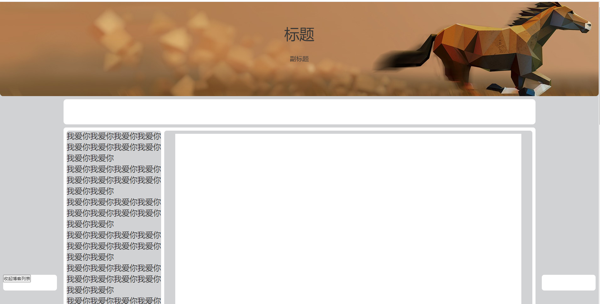
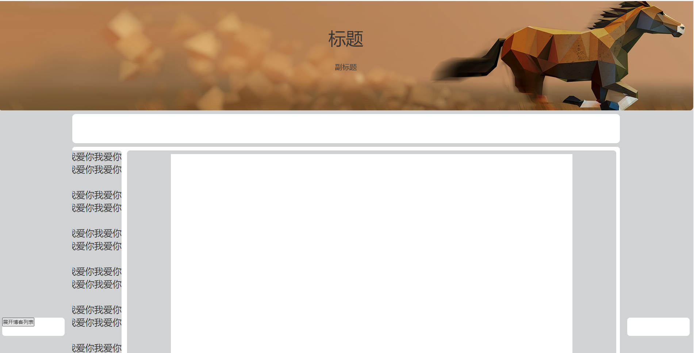

# 我的博客
我的个人博客，是用来分享我自己的生活，我自己的成长点滴，不仅仅是个博客，
他也是我个人网站，别人可以评论我的分享，我可与回复他们，我可以在上面上
传我喜欢的电影，歌曲，图片，记录我自己的心里话，写日记（我自己看），
要有我自己网站的后台管理系统，不用每次需要修改东西还要修改代码，那样太
麻烦。暂时就这样把...
## 阶段性功能
* 一阶段：实现博客主要功能
    * 前台页面搭建完成（不包含后台管理系统）
	* 后台服务初始化搭建
	* 实现登录注册功能
	* 博主可以写博客，查看自己的博客
	* 暂时先上面这么多吧，其他功能以后再加  

## 一阶段功能详细说明
* 前台页面搭建完成（不包含后台管理系统）：  
首先进入网站是欢迎页，如果用户之前登录过了，并且自动登录就显示用户名和欢迎语，
页面初始化的时候就同步请求后台登录接口，如果请求中包含用户认证cookie，服务端返回
用户信息，用户信息包含用户名、用户id等等，然后欢迎页面在指定时间内自动消失，进入主页
部分，用户也可以点击欢迎页按钮将欢迎页立即隐藏并进入主页。  
  
主页部分，主页部分，中间一块是内容区域，内容区域分为两块，左侧是博客列表，右侧是博客
内容左侧博客列表可以隐藏，当用户进入主页之后，博客列表默认隐藏，中间区域是博客列表，
每页一共#个博客最下面是可以跳页数，做好动画效果，当用户点击某一个博客的时候内容区域
右侧就显示markdown转译后的html内容,右上角有登录按钮，当用户点击登录就在当前页面显示
一个div，让用户输入认证信息，暂时只用账号密码，其他认证方式以后添加，登陆成功后刷新
当前页面，将用户登录的用户名显示在右上角，旁边显示退出登录按钮，并将主页内容博客列表
刷新成当前用户的博客列表，暂时以服务自己为宗旨为中心做页面。博客详情点进去之后，拉到最下面
有评论模块，评论模块和博客正文之间是评论显示区。主页大概长下面这个样子： 
  

* 后台服务初始化搭建：  
首先建表，数据库采用mysql，首先是用户表（[用户表设计参考](http://wpceo.com/user-database-table-design/ "wpceo的博客")）
，考虑到以后的可扩展性，建立用户表将用户信息表和用户认证表进行拆分，衍生处一个认证方式表
用来记录本站已支持的认证方式，然后还需要实现权限管理功能，暂时想到管理员权限，和普通用户权限
管理员不光可以管理自己的博客，还可以管理整个网站所有人的博客，和一些其他东西（真的费脑子.....）
